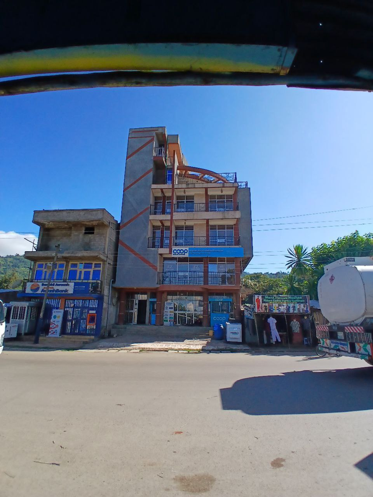
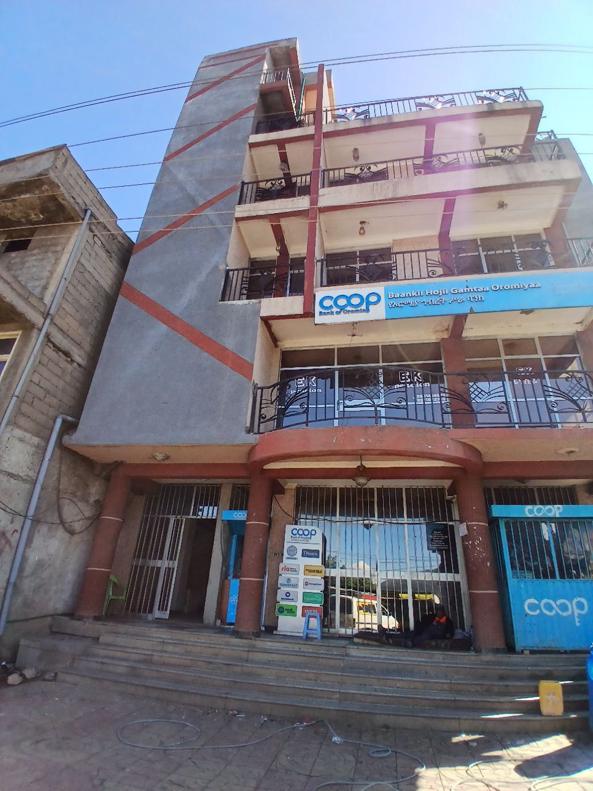

# index.html
<!DOCTYPE html>
<html lang="en">
<head>
    <meta charset="UTF-8">
    <meta name="viewport" content="width=device-width, initial-scale=1.0">
    <title>EK Guest House - A Relaxing Stay in Chelenko</title>
    
</head>
<body>

    <header>
        

            
        

        <nav>
            <ul>
                <li><a href="index.html">Home</a></li>
                <li><a href="rooms.html">Rooms</a></li>
                <li><a href="contact.html">Contact</a></li>
                <li><a href="booking.html">Book Now</a></li>
                <li><a href="https://maps.app.goo.gl/HMy6XD2g1J5Yy44i8">Map</a></li>  
            </ul>
        </nav>
    </header>

    <main>
        <section class="hero-section">
            <h1>Welcome to EK Guest House</h1>
            
Your Peaceful Retreat in Chelenko, Oromia

        </section>

        <section class="photo-gallery">
            
            
            
        </section>
    </main>

    <footer>
        
© 2025 EK Guest House. All Rights Reserved.

    </footer>

</body>
</html>
